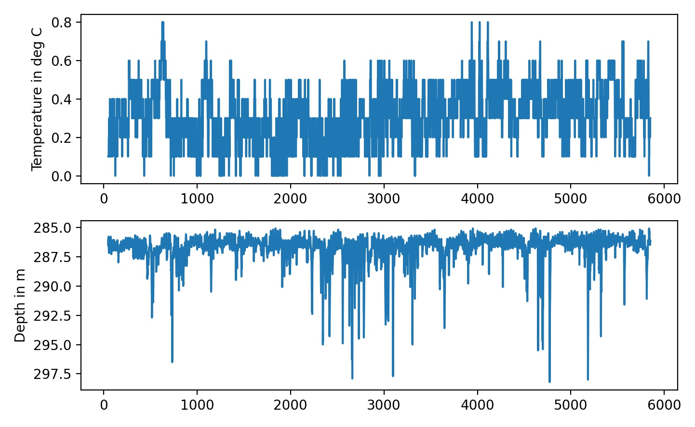
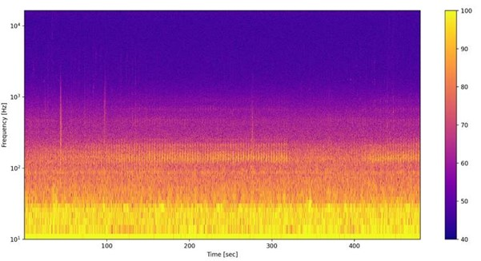
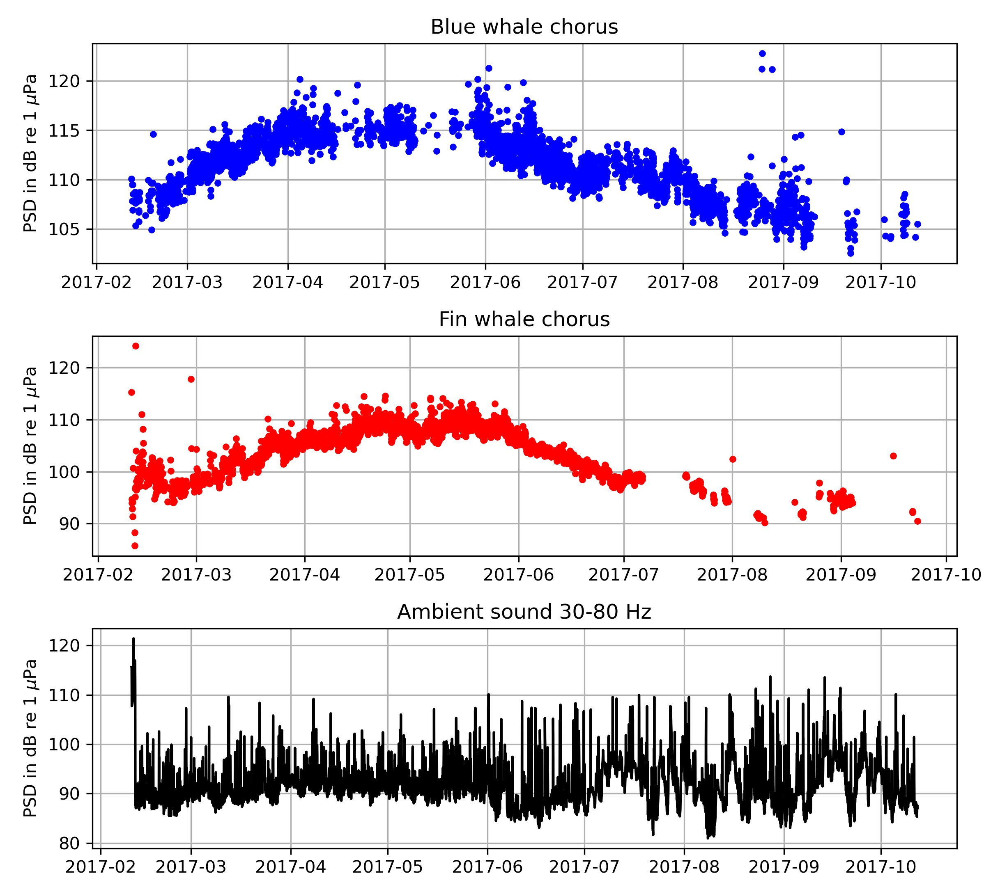
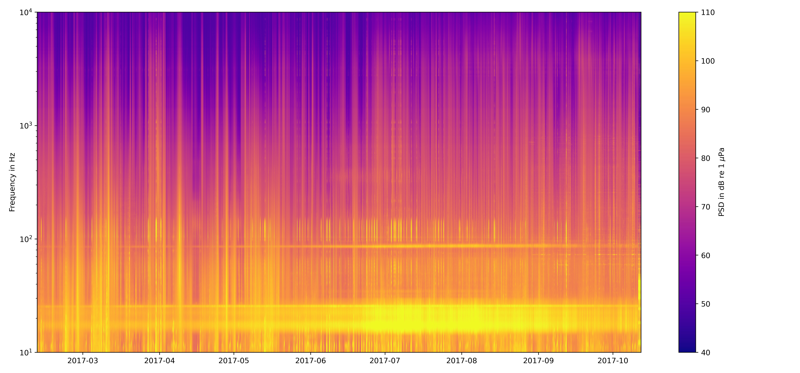

# Analyzing ambient sound recordings from Aural M2 recorders with python

This is a short tutorial on how I process and analyze passive acoustic data from autonomous underwater recorders that are moored in the ocean for up to several years. I am interested in analyzing how the ambient sound varies with time and location, and how loud the "choruses" of different marine mammal of vocalizations  are over time. To achieve this I am simply simply calculating the power spectral density (PSD) over a 5 minute time period, so that I get one spectrum per recording. But lets start at the beginning. 

## Splitting the .wav files

Once you have recovered the Aural M2 recorder, you need to download the data onto your local drive and split the .wav files into the correct lengths (as they are bunched together in large files by the recorder software). Here I am using python 3 and  import these modules:

```python
import numpy as np
from matplotlib import pyplot as plt
import scipy.io.wavfile as wav
from scipy import signal
import glob
import pandas as pd
import datetime as dt
```
I am using this code and the Aural M-2 software InfoWav to split the files so that each .wav file contains only recordings from the their respective 8-min snippet:
```python
metadata = pd.read_csv(r"C:\Users\admin\Documents\passive_acoustics\MASTER\Bilan_D7BA_20201125151336.txt",sep=';',header=None,index_col=False)
targetfolder=r"C:\Users\a5278\Documents\passive_acoustics\aural_wav_files\\"

for name in glob.glob(r"C:\Users\admin\Documents\passive_acoustics\aural_raw_wav\*.wav"): 
    print(name) 
    fs, x = wav.read(name)
    
    recordlength=fs*60*8
    ix_segment=np.arange(0,5,1)*recordlength
    
    ix_metadata=np.where( metadata.iloc[:,0] ==name )[0]
    #ix_mark=np.where( x==-16192 )[0]
    
    ix_start=0
    for ix in ix_metadata:
        datestr=metadata.iloc[ix,9]+'_'+metadata.iloc[ix,10]
        datestr=datestr.replace('/','_')
        datestr=datestr.replace(':','_')
        
        print('aural_'+datestr)
        x_file=x[ix_segment[ix_start]+10:ix_segment[ix_start+1]-10]       
        wav.write(targetfolder+'aural_'+datestr+'.wav',fs,x_file)  
        ix_start=ix_start+1
```

To check if anything weired happened to the mooring, I am looking at the temperature and depth logged by the aural. The mooring did move, but no single dive event stands out:

```python
fig=plt.figure(num=1)      
plt.clf()
plt.subplot(211)
plt.plot( pd.to_numeric( metadata.iloc[50:-1,3].str.replace(',','.') ) )
plt.ylabel('Temperature in deg C')
plt.subplot(212)
plt.plot(pd.to_numeric( metadata.iloc[50:-1,4].str.replace(',','.') ) )
plt.ylabel('Depth in m')
plt.gca().invert_yaxis()
plt.tight_layout()
```



## Spectrograms for each .wav file

With this script you can generate spectrograms for each .wav file in a folder, for visual analysis of marine mammal calls or the like:

```python
wavfolder=r'I:\postdoc_krill\pam\2017_aural'

for name in glob.glob(wavfolder+'\*.wav',recursive=True): 
    print(name) 
    fs, x = wav.read(name)
    
    db_saturation=155
    x=x/32767 
    p =np.power(10,(db_saturation/20))*x #convert data.signal to uPa    
    
    f, t, Sxx = signal.spectrogram(p, fs, window='hamming',nperseg=2**13)
    
    fig=plt.figure(num=1)      
    fig.set_size_inches(15, 7)
    plt.clf()
    
    plt.pcolormesh(t, f, 10*np.log10(Sxx) ,cmap='plasma')
    plt.ylabel('Frequency [Hz]')
    plt.xlabel('Time [sec]')
    plt.yscale('symlog')
    plt.ylim([10,f[-1]])
    plt.clim([40,100])
    plt.colorbar()
    #plt.show()
    
    plt.savefig( name[0:-4]+'.jpg',dpi=200 )
```

This will produce a spectrogram like this for each wav file:



## Long term spectrogram and marine mammal chorus levels

Instead of calculating the spectrogram for each wav file, we can also calculate the average PSD (spectrum) for each file. This is a simple and efficient way to study the ambient sound. As you can see from the spectrogram above most the the recording is ambient sound. So if we just average over the entire recordings we get a good measure of how much sound energy is in each frequency band. 

For each spectrum (wav file), we can also pick out how much energy is in some of the characteristic peaks. In my case there are two defined peaks in the spectra: the blue whale chorus at around 27 HZ and the fin whale chorus around between 80 and 90 Hz.  To calculate the sound levels of these choruses i subtract interpolated ambient sound pressure from the measured sound presser in the chorus frequency band. 

The entire script to calculate the spectra and chorus levels then looks like this:

```python
flog=np.logspace(1,4,1000)

meta=pd.DataFrame(columns=['filenames','time','chorus_bw','chorus_bw_snr','chorus_fin','chorus_fin_snr'])
meta['filenames']=glob.glob(wavfolder+'\*.wav')

lt_spec=pd.DataFrame( np.ones( [ meta.shape[0], flog.shape[0] ] ) * np.nan )

for i,row in meta.iterrows():    
    try:          
        name=meta.iloc[i,0]
        print(name) 
        
        t= dt.datetime.strptime( name.split('\\')[-1].split('.')[0] , 'aural_%Y_%m_%d_%H_%M_%S' ) 
        meta.iloc[i,1]=t
        
        fs, x = wav.read(name)  
        db_saturation=155
        x=x/32767 
        p =np.power(10,(db_saturation/20))*x #convert data.signal to uPa    
        f, Pxx = signal.welch(p, fs, window='hamming',nperseg=2**16)
        specint=np.interp(flog,f,Pxx)
        
        # fig=plt.figure(num=1)      
        # plt.clf()
        # plt.plot(f,10*np.log10(Pxx) ,'-k')
        # plt.plot(flog,10*np.log10(specint) ,'.r')
        # plt.xscale('log')
        # plt.xlim([10,f[-1]])
        # plt.ylim([40,105])
        
        ######### blue whale chorus
        ix_f=(flog>23) &( flog<31) 
        ix_fit= (flog>23) & (flog<24.4) | ( flog>26.7)&( flog<31)
        ix_chorus= (flog>24.4) & ( flog<26.7)
         
        x=np.log(flog[ix_fit])
        y=10*np.log10(specint[ix_fit])
        xf=np.log(flog[ix_f])
        xchorus=np.log(flog[ix_chorus])
        pf=np.poly1d( np.polyfit(x,y,1 ) )  
        
        p_chorus= np.sum( specint[ix_chorus])      
        p_ambient=np.sum( np.power(10,pf( xchorus )/10) ) 
        chorus_level_bw= 10*np.log10( p_chorus-p_ambient )
        
        meta.iloc[i,2]=chorus_level_bw
        meta.iloc[i,3]=10*np.log10( p_chorus/p_ambient )
        
        ######### fin chorus
        ix_f=(flog>70) &( flog<100) 
        ix_fit= (flog>75) & (flog<82) | ( flog>90)&( flog<98)
        ix_chorus= (flog>82) & ( flog<90)
         
        x=np.log(flog[ix_fit])
        y=10*np.log10(specint[ix_fit])
        xf=np.log(flog[ix_f])
        xchorus=np.log(flog[ix_chorus])
        pf=np.poly1d( np.polyfit(x,y,1 ) )  
        
        p_chorus= np.sum( specint[ix_chorus])      
        p_ambient=np.sum( np.power(10,pf( xchorus )/10) ) 
        chorus_level_fin= 10*np.log10( p_chorus-p_ambient )    
        
        meta.iloc[i,4]=chorus_level_fin
        meta.iloc[i,5]=10*np.log10( p_chorus/p_ambient )
        
        lt_spec.iloc[i,:]=specint
    except: 
        print('error')
```

After this is complete we can plot the chorus and ambient sound levels:
```python
fig=plt.figure(num=11)      
plt.clf()

plt.subplot(311)
ix_valid=meta['chorus_bw_snr']>3
plt.plot(meta['time'][ix_valid],meta['chorus_bw'][ix_valid],'.b')
plt.ylabel('PSD in dB re 1 $\mu$Pa')
plt.title('Blue whale chorus')
plt.grid()

plt.subplot(312)
ix_valid=meta['chorus_fin_snr']>3
plt.plot(meta['time'][ix_valid],meta['chorus_fin'][ix_valid],'.r')
plt.ylabel('PSD in dB re 1 $\mu$Pa')
plt.title('Fin whale chorus')
plt.grid()

ix=(flog>30) & (flog<80)
psd_ambient=  10*np.log10(  np.mean( lt_spec.iloc[:,ix],axis=1 )  ) 
plt.subplot(313)
plt.plot(meta['time'],psd_ambient,'-k')
plt.ylabel('PSD in dB re 1 $\mu$Pa')
plt.title('Ambient sound 30-80 Hz')
plt.grid()

plt.tight_layout()
# plt.savefig( 'choruses_and_ambient_2017.jpg',dpi=300 )
```



To plot the long term spectrogram we can use the function pcolormesh:
```python
fig=plt.figure(num=10)      
fig.set_size_inches(15, 7)
plt.clf()
plt.pcolormesh(meta['time'],flog,np.flip(np.rot90( 10*np.log10(lt_spec) )),cmap='plasma')
plt.yscale('log')
plt.ylim([10,1e4])
plt.clim([40,110])
plt.colorbar(label='PSD in dB re 1 $\mu$Pa')
plt.ylabel('Frequency in Hz')
plt.tight_layout()

# plt.savefig('longterm_spectrogram_2017.jpg',dpi=400 )
```


